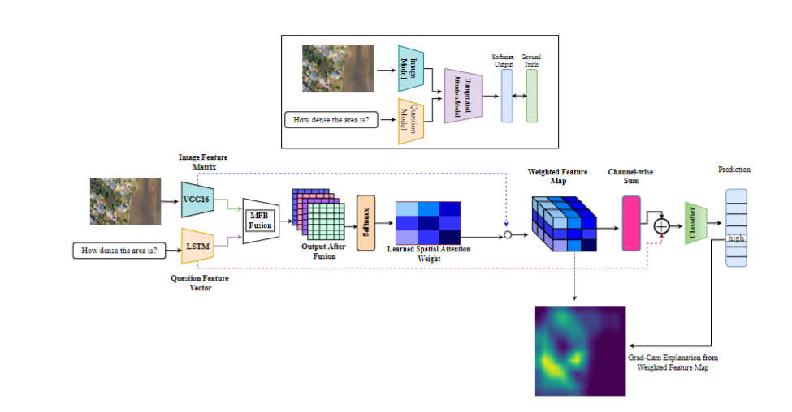
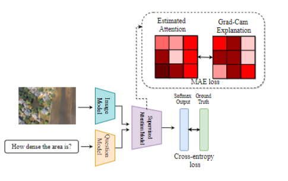
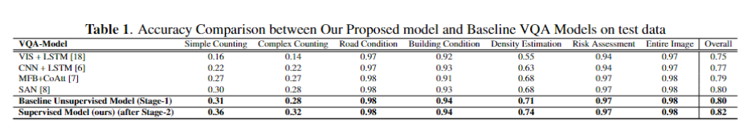

## Grad-Cam Aware Supervised Attention for Visual Question Answering for Post-Disaster Damage Assessment [##ICIP Paper](https://ieeexplore.ieee.org/abstract/document/9897381)

### Motivation
In this paper, we present a Grad-Cam aware supervised attention framework for visual question answering (VQA) tasks for post-disaster damage assessment purposes. Visual attention in visual question-answering tasks aims to focus on relevant image regions according to questions to predict answers. However, the conventional attention mechanisms in VQA work in an unsupervised manner, learning to give importance to visual contents by minimizing only task-specific loss. This approach fails to provide appropriate visual attention where the visual contents are very complex. The content and nature of UAV images in the FloodNet-VQA dataset are very complex as they depict the hazardous scenario after Hurricane Harvey from a high altitude. To tackle this, we propose a supervised attention mechanism that uses explainable features from Grad-Cam to supervise visual attention in the VQA pipeline. The mechanism we propose operates in two stages. In the first stage of learning, we derived the visual explanations through Grad-Cam by training a baseline attention-based VQA model. In the second stage, we supervise our visual content for each question by incorporating the Grad-Cam explanations from the previous phase of the training process. We have improved the model performance over the state-of-the-art VQA models by a considerable margin on the FloodNet dataset.

### METHODOLOGY

#### Stage 1
In the first stage, train a baseline attention-based VQA model with cross-entropy loss. Predictions from this model will help to extract the visual explanations for each image-question pair through Grad-Cam architecture.

#### Stage 2
Explanations from stage 1 will be considered to supervise visual attention.

#### Model Performance

